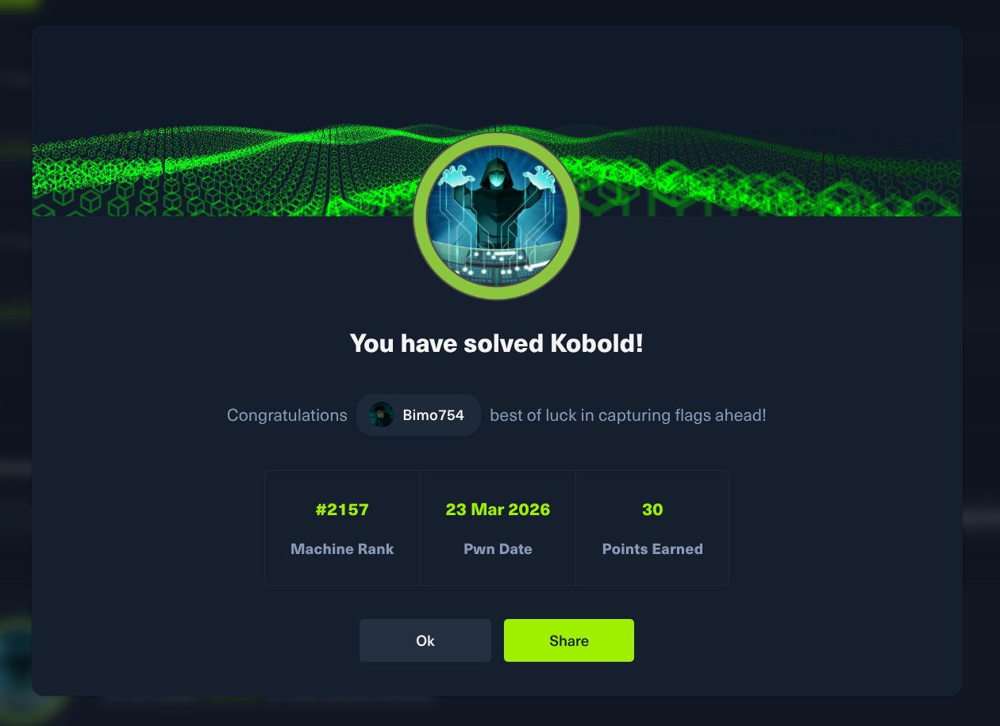

## Social



Connect with me using [LinkedIn](https://www.linkedin.com/in/mohamad-chahed)

## HTB Kobold Writeup

### Basic enumeration

Hosts file

```sh
sudo nano /etc/hosts
```

```sh
<IP>	kobold.htb
```

Port scan using [dmap](https://github.com/Bimo754/Dmap)

```sh
dmap -a kobold.htb -n
```

```txt
[Info] Probing TCP Ports

[Info] Open TCP port: 22
[Info] Open TCP port: 443
[Info] Open TCP port: 80
[Info] Open TCP port: 3552

[Info] Scanning TCP Ports
 [Info] Started Service Scan
 [Info] Service scan Timing: About 25.00% done; ETC: 21:47 (0:00:18 remaining)
 [Info] Service scan Timing: About 25.00% done; ETC: 21:47 (0:00:18 remaining)
 [Info] Service scan Timing: About 50.00% done; ETC: 21:47 (0:00:12 remaining)
 [Info] Service scan Timing: About 50.00% done; ETC: 21:47 (0:00:13 remaining)
 [Info] Service scan Timing: About 75.00% done; ETC: 21:47 (0:00:06 remaining)
 [Info] Service scan Timing: About 75.00% done; ETC: 21:53 (0:01:32 remaining)
 [Info] Service scan Timing: About 75.00% done; ETC: 21:53 (0:01:34 remaining)
 [Info] Service scan Timing: About 75.00% done; ETC: 21:53 (0:01:35 remaining)
 [Info] Service scan Timing: About 100.00% done; ETC: 21:52 (0:00:00 remaining)
 [Info] Finished Service Scan
 [Info] Started Script Scanning

										Finished Scan

Nmap scan report for kobold.htb (10.129.15.28)
Host is up (0.11s latency).

PORT STATE SERVICE VERSION
22/tcp open ssh OpenSSH 9.6p1 Ubuntu 3ubuntu13.15 (Ubuntu Linux; protocol 2.0)
| ssh-hostkey:
| 256 8c:45:12:36:03:61:de:0f:0b:2b:c3:9b:2a:92:59:a1 (ECDSA)
|_ 256 d2:3c:bf:ed:55:4a:52:13:b5:34:d2:fb:8f:e4:93:bd (ED25519)
80/tcp open http nginx 1.24.0 (Ubuntu)
|_http-title: Did not follow redirect to https://kobold.htb/
| http-methods:
|_ Supported Methods: GET HEAD POST OPTIONS
|_http-server-header: nginx/1.24.0 (Ubuntu)
443/tcp open ssl/http nginx 1.24.0 (Ubuntu)
| http-methods:
|_ Supported Methods: GET HEAD
|_http-title: Kobold Operations Suite
| tls-alpn:
| http/1.1
| http/1.0
|_ http/0.9
|_http-server-header: nginx/1.24.0 (Ubuntu)
| ssl-cert: Subject: commonName=kobold.htb
| Subject Alternative Name: DNS:kobold.htb, DNS:*.kobold.htb
| Issuer: commonName=kobold.htb
| Public Key type: rsa
| Public Key bits: 2048
| Signature Algorithm: sha256WithRSAEncryption
| Not valid before: 2026-03-15T15:08:55
| Not valid after: 2125-02-19T15:08:55
| MD5: c49e c4d5 d4a0 e473 00bc 8df8 cc00 98ac
| SHA-1: a231 1d00 d15b 2007 eff5 957d 0561 265a bb90 6906
|_SHA-256: 0395 2d40 2b1f 2245 6092 f007 1ae7 6c6d 34d9 0ae3 c04f 271d db92 8907 e4e3 acfe
|_ssl-date: TLS randomness does not represent time
3552/tcp open http Golang net/http server
| http-methods:
|_ Supported Methods: GET HEAD POST OPTIONS
|_http-favicon: Unknown favicon MD5: F9C2482A3FE92BDB5276156F46E0D292
|_http-title: Site doesn't have a title (text/html; charset=utf-8).
| fingerprint-strings:
| GenericLines:
.
.
.
```

We can see we have 4 ports

- `22`
- `80`
- `443`
- `3552`

We can say our vulnerabilities are web based

### Web

We start by visiting `http://kobold.htb` on port `80` and notice we get forced to use port `443` which is `https://kobold.htb`

We start by enumerating the directories of the web page but nothing is found

```sh
dirsearch -u https://kobold.htb
```

We then enumerate the subdomains using `ffuf`

```sh
ffuf -u 'https://kobold.htb' -H "Host:FUZZ.kobold.htb" -w /usr/share/seclists/Discovery/DNS/subdomains-top1million-110000.txt -fw 4
```

```txt

        /'___\  /'___\           /'___\       
       /\ \__/ /\ \__/  __  __  /\ \__/       
       \ \ ,__\\ \ ,__\/\ \/\ \ \ \ ,__\      
        \ \ \_/ \ \ \_/\ \ \_\ \ \ \ \_/      
         \ \_\   \ \_\  \ \____/  \ \_\       
          \/_/    \/_/   \/___/    \/_/       

       v2.1.0-dev
________________________________________________

 :: Method           : GET
 :: URL              : https://kobold.htb
 :: Wordlist         : FUZZ: /usr/share/seclists/Discovery/DNS/subdomains-top1million-110000.txt
 :: Header           : Host: FUZZ.kobold.htb
 :: Follow redirects : false
 :: Calibration      : false
 :: Timeout          : 10
 :: Threads          : 40
 :: Matcher          : Response status: 200-299,301,302,307,401,403,405,500
 :: Filter           : Response words: 4
________________________________________________

mcp                     [Status: 200, Size: 466, Words: 57, Lines: 15, Duration: 153ms]
bin                     [Status: 200, Size: 24402, Words: 1218, Lines: 386, Duration: 257ms]
```

We can see we have the subdomains `mcp` and `bin` so we add them to `/etc/hosts` file

Now we have the following targets to check

- `mcp.kobold.htb`
- `bin.kobold.htb`
- `kobold.htb:3552`

## Warning

The machine Kobold is currently active on HTB, you can DM me on [LinkedIn](https://www.linkedin.com/in/mohamad-chahed) for hints or wait for the machine to retire
