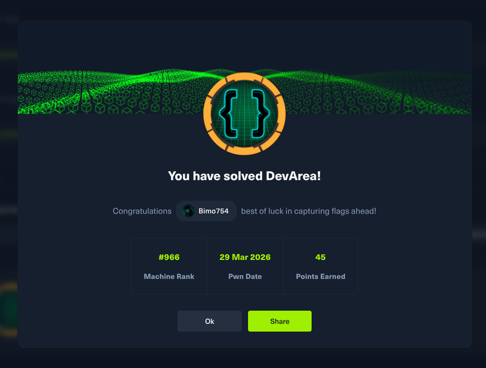
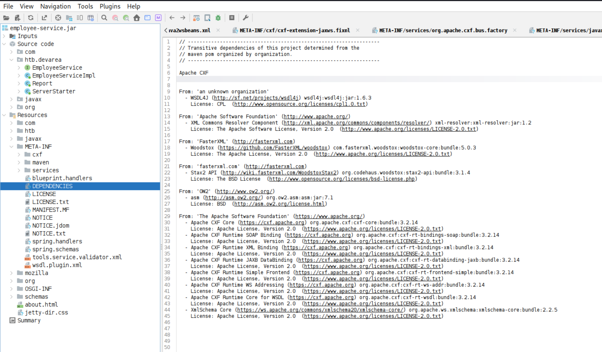

## Social



Connect with me using [LinkedIn](https://www.linkedin.com/in/mohamad-chahed)

## HTB DevArea Writeup

### Enumeration

We start by adding the ip to `/etc/hosts`

```sh
sudo nano /etc/hosts
```

And we do nmap scan using the tool [dmap](https://github.com/Bimo754/Dmap)

```sh
dmap -a devarea.htb
```

```txt
Nmap scan report for devarea.htb (10.129.17.224)
Host is up (0.082s latency).

PORT STATE SERVICE VERSION
21/tcp open ftp vsftpd 3.0.5
| ftp-anon: Anonymous FTP login allowed (FTP code 230)
|_drwxr-xr-x 2 ftp ftp 4096 Sep 22 2025 pub
| ftp-syst:
| STAT:
| FTP server status:
| Connected to ::ffff:10.10.14.42
| Logged in as ftp
| TYPE: ASCII
| No session bandwidth limit
| Session timeout in seconds is 300
| Control connection is plain text
| Data connections will be plain text
| At session startup, client count was 1
| vsFTPd 3.0.5 - secure, fast, stable
|_End of status
22/tcp open ssh OpenSSH 9.6p1 Ubuntu 3ubuntu13.15 (Ubuntu Linux; protocol 2.0)
| ssh-hostkey:
| 256 83:13:6b:a1:9b:28:fd:bd:5d:2b:ee:03:be:9c:8d:82 (ECDSA)
|_ 256 0a:86:fa:65:d1:20:b4:3a:57:13:d1:1a:c2:de:52:78 (ED25519)
80/tcp open http Apache httpd 2.4.58
| http-methods:
|_ Supported Methods: GET POST OPTIONS HEAD
|_http-server-header: Apache/2.4.58 (Ubuntu)
|_http-title: DevArea - Connect with Top Development Talent
8080/tcp open http Jetty 9.4.27.v20200227
|_http-server-header: Jetty(9.4.27.v20200227)
|_http-title: Error 404 Not Found
8500/tcp open http Golang net/http server
|_http-title: Site doesn't have a title (text/plain; charset=utf-8).
| fingerprint-strings:
| GenericLines, Hello, Help, Kerberos, RTSPRequest, SSLSessionReq, SSLv23SessionReq, TLSSessionReq, TerminalServerCookie:
| HTTP/1.1 400 Bad Request
| Content-Type: text/plain; charset=utf-8
| Connection: close
| Request
| GetRequest, HTTPOptions:
| HTTP/1.0 500 Internal Server Error
| Content-Type: text/plain; charset=utf-8
| X-Content-Type-Options: nosniff
| Date: Sat, 28 Mar 2026 19:09:28 GMT
| Content-Length: 64
|_ This is a proxy server. Does not respond to non-proxy requests.
8888/tcp open http Golang net/http server (Go-IPFS json-rpc or InfluxDB API)
| http-methods:
|_ Supported Methods: GET HEAD POST OPTIONS
|_http-title: Hoverfly Dashboard
|_http-favicon: Unknown favicon MD5: BAA090FBC1418C8C4971002CC5459574
```

We have the following ports to check

- `21`		FTP
- `80`		Web
- `8080`	Web
- `8888`	Web
- `8500`	Web

## FTP

Checking default credentials using hydra and [this wordlist](https://github.com/govolution/betterdefaultpasslist)

```sh
hydra -C ftp.txt ftp://devarea.htb
```

```txt
[21][ftp] host: devarea.htb   login: ftp   password: b1uRR3
[21][ftp] host: devarea.htb   login: ftp   password: ftp
```

So we can login using default credentials `ftp:ftp` using the command

```sh
ftp ftp@devarea.htb
```

Checking the files we can see there is a file inside `pub/employee-service.jar`
So we download it using `get pub/employee-service.jar`

We then reverse engineer the program using the [jadx](https://github.com/skylot/jadx) program



### Warning

The machine is still active on HTB, the writeup won't be published until the machine is retired, if you need hints don't hesitate to contact me on [LinkedIn](https://linkedin.com/in/mohamad-chahed)
