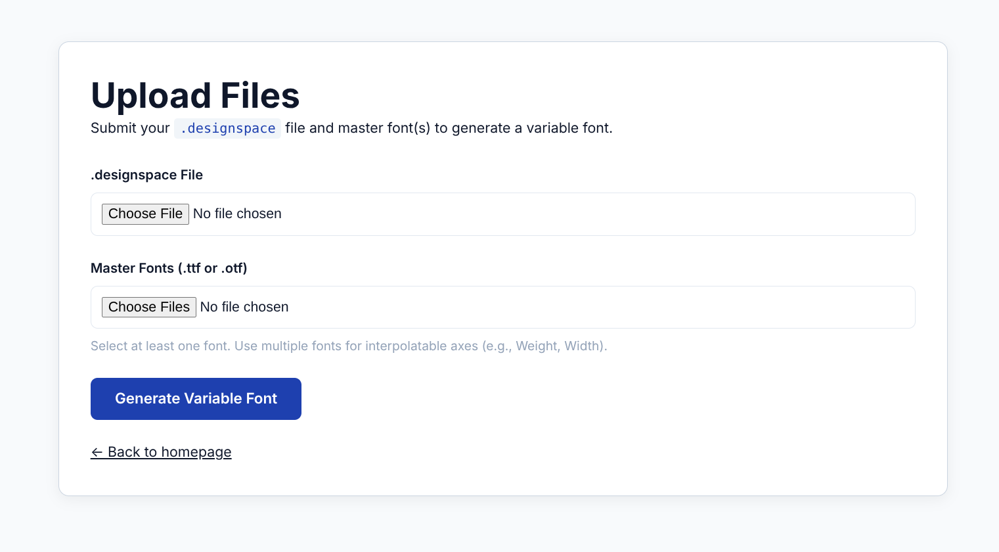

## HTB VariaType Writeup

### Basic enumeration

Hosts file

```sh
sudo nano /etc/hosts
```

```txt
<IP>	variatype.htb
```

Port scan using [dmap](https://github.com/Bimo754/Dmap)

```sh
dmap -a variatype.htb
```

```txt
[Info] Probing TCP Ports

[Info] Open TCP port: 22
[Info] Open TCP port: 80

[Info] Scanning TCP Ports
 [Info] Started Service Scan
 [Info] Finished Service Scan
 [Info] Started Script Scanning

										Finished Scan

Nmap scan report for variatype.htb (10.129.8.244)
Host is up (0.083s latency).
rDNS record for 10.129.8.244: variatype.htb

PORT STATE SERVICE VERSION
22/tcp open ssh OpenSSH 9.2p1 Debian 2+deb12u7 (protocol 2.0)
| ssh-hostkey:
| 256 e0:b2:eb:88:e3:6a:dd:4c:db:c1:38:65:46:b5:3a:1e (ECDSA)
|_ 256 ee:d2:bb:81:4d:a2:8f:df:1c:50:bc:e1:0e:0a:d1:22 (ED25519)
80/tcp open http nginx 1.22.1
|_http-server-header: nginx/1.22.1
| http-methods:
|_ Supported Methods: GET OPTIONS HEAD
|_http-title: VariaType Labs \xE2\x80\x94 Variable Font Generator
Service Info: OS: Linux; CPE: cpe:/o:linux:linux_kernel

NSE: Script Post-scanning.
Initiating NSE at 16:32
Completed NSE at 16:32, 0.00s elapsed
Initiating NSE at 16:32
Completed NSE at 16:32, 0.00s elapsed
Initiating NSE at 16:32
Completed NSE at 16:32, 0.00s elapsed
Read data files from: /usr/share/nmap
Service detection performed. Please report any incorrect results at https://nmap.org/submit/ .
Nmap done: 1 IP address (1 host up) scanned in 9.51 seconds
Raw packets sent: 6 (240B) | Rcvd: 3 (116B)
```

We can confidently say we are going for web exploitation techniques

### Web

Visiting the site we can see there is a file upload functionality



I have tried few file upload vulnerabilities but nothing was found
Lets keep this upload functionality in mind because it will be helpful later

Enumerating the subdomains we find a subdomain

```sh
ffuf -u 'http://variatype.htb/' -H "Host:FUZZ.variatype.htb" -w /usr/share/seclists/Discovery/DNS/subdomains-top1million-110000.txt -fw 5
```

```txt

        /'___\  /'___\           /'___\       
       /\ \__/ /\ \__/  __  __  /\ \__/       
       \ \ ,__\\ \ ,__\/\ \/\ \ \ \ ,__\      
        \ \ \_/ \ \ \_/\ \ \_\ \ \ \ \_/      
         \ \_\   \ \_\  \ \____/  \ \_\       
          \/_/    \/_/   \/___/    \/_/       

       v2.1.0-dev
________________________________________________

 :: Method           : GET
 :: URL              : http://variatype.htb/
 :: Wordlist         : FUZZ: /usr/share/seclists/Discovery/DNS/subdomains-top1million-110000.txt
 :: Header           : Host: FUZZ.variatype.htb
 :: Follow redirects : false
 :: Calibration      : false
 :: Timeout          : 10
 :: Threads          : 40
 :: Matcher          : Response status: 200-299,301,302,307,401,403,405,500
 :: Filter           : Response words: 5
________________________________________________

portal                  [Status: 200, Size: 2494, Words: 445, Lines: 59, Duration: 137ms]
```

We have `portal.variatype.htb` subdomain so we add that to `/etc/hosts` file

Visiting the site we see that there is a login page


Directory searching the site using `dirsearch`

```sh
dirsearch -u http://portal.variatype.htb
```

```txt

  _|. _ _  _  _  _ _|_    v0.4.3
 (_||| _) (/_(_|| (_| )

Extensions: php, aspx, jsp, html, js | HTTP method: GET | Threads: 25 | Wordlist size: 11460

Output File: /home/diamond/Hacking/Hackthebox/Machines/VariaType/Writeup/reports/http_portal.variatype.htb/_26-03-15_16-39-14.txt

Target: http://portal.variatype.htb/

[16:39:14] Starting: 
[16:39:17] 301 -  169B  - /.git  ->  http://portal.variatype.htb/.git/
[16:39:17] 403 -  555B  - /.git/branches/
[16:39:17] 403 -  555B  - /.git/
[16:39:17] 200 -   39B  - /.git/COMMIT_EDITMSG
[16:39:17] 200 -  143B  - /.git/config
[16:39:17] 200 -   73B  - /.git/description
[16:39:17] 200 -   23B  - /.git/HEAD
[16:39:17] 403 -  555B  - /.git/hooks/
[16:39:17] 200 -  137B  - /.git/index
[16:39:17] 403 -  555B  - /.git/info/
[16:39:17] 200 -  240B  - /.git/info/exclude
[16:39:17] 403 -  555B  - /.git/logs/
[16:39:17] 200 -  700B  - /.git/logs/HEAD
[16:39:17] 200 -  700B  - /.git/logs/refs/heads/master
[16:39:17] 301 -  169B  - /.git/logs/refs/heads  ->  http://portal.variatype.htb/.git/logs/refs/heads/
[16:39:17] 301 -  169B  - /.git/logs/refs  ->  http://portal.variatype.htb/.git/logs/refs/
[16:39:17] 403 -  555B  - /.git/objects/
[16:39:17] 403 -  555B  - /.git/refs/
[16:39:17] 200 -   41B  - /.git/refs/heads/master
[16:39:17] 301 -  169B  - /.git/refs/heads  ->  http://portal.variatype.htb/.git/refs/heads/
[16:39:17] 301 -  169B  - /.git/refs/tags  ->  http://portal.variatype.htb/.git/refs/tags/
[16:39:30] 200 -    0B  - /auth.php
[16:39:34] 302 -    0B  - /dashboard.php  ->  /
[16:39:35] 302 -    0B  - /download.php  ->  /
[16:39:37] 301 -  169B  - /files  ->  http://portal.variatype.htb/files/
[16:39:37] 403 -  555B  - /files/
[16:40:00] 302 -    0B  - /view.php  ->  /

Task Completed

```

### Warning

The machine is still active on HTB, the writeup won't be published until the machine is retired, if you need hints don't hesitate to contact me on [LinkedIn](https://linkedin.com/in/mohamad-chahed)
